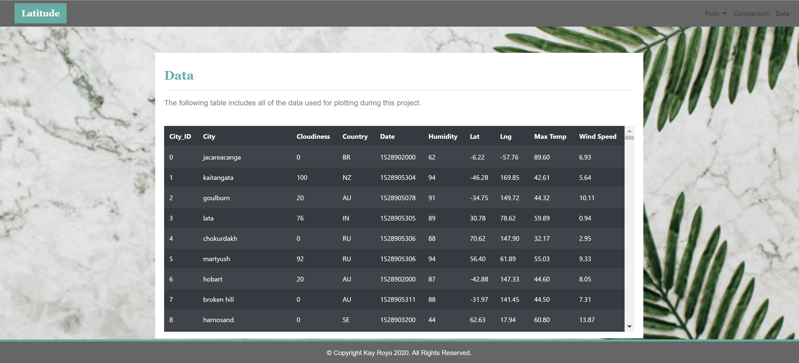

# Web Visualization Dashboard

https://kayannr.github.io/web-visualization-dashboard/WebVisualizations/index.html

## Background
A Visualization Dashboard Website of Weather in 500+ World Cities Relative to the Equator at Different Latitudes Using HTML5, CSS3 and Bootstrap 4. 

## Website Features 
The dashboard includes individual pages for each plot and a means by which a user can navigate between them. These pages contain the visualizations and corresponding explanations. It also includes a landing page, a page where we can see a comparison of all of the plots, and another page where we can view the data used to build them. The following pages are included in the website: 

* A landing page containing:
  * An explanation of the project.
  * Links to each visualizations page.
  
* Four visualization pages each with:
  * A descriptive title and heading tag.
  * The plot/visualization itself for the selected comparison.
  * A paragraph describing the plot and its significance.
  
  
  
  
* A "Comparisons" page that:
  * Contains all of the visualizations on the same page so we can easily visually compare them.
  * Uses a bootstrap grid for the visualizations.
    * The grid has two visualizations across on screens medium and larger, and 1 across on extra-small and small screens.
     
* A "Data" page that:
  * Displays a responsive table containing the data used in the visualizations.
    * The table uses a bootstrap table component. (https://getbootstrap.com/docs/4.3/content/tables/#responsive-tables)
    * The data is  converted from csv to html using a method approprately called `to_html` that allows a generation of HTML table from a pandas dataframe. 
  
 
The website has a navigation menu that:

* Has the name of the site on the left of the nav which allows users to return to the landing page from any page.
* Contains a dropdown on the right of the navbar named "Plots" which provides links to each individual visualization page.
* Provides two more links on the right: "Comparisons" which links to the comparisons page, and "Data" which links to the data page.
* Is responsive (using media queries). 

